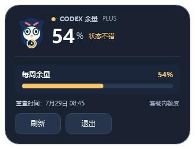

# Codex 余量宠物

本分支由 **TheLogosTech** 维护，基于 [lanyiyrt/codex-usage-pet](https://github.com/lanyiyrt/codex-usage-pet)，原作者为于瑞涛。保留原始 MIT 版权和许可声明。

[English](README.md) · [更新记录](CHANGELOG.md) · [隐私说明](PRIVACY.md)

一只悬浮在 Windows 桌面的 Codex 余量宠物。它通过本机 `codex app-server` 读取当前套餐的用量窗口，把剩余百分比、重置时间和连接状态放在一个轻量、可拖动的小组件里。

> 这是社区开源项目，并非 OpenAI 官方产品。当前版本仅支持 Windows。

<p align="center">
  
  
  
</p>

## 特性

- 展示各额度周期的剩余百分比、独立重置时间和倒计时进度条
- 设置面板可选择主数字显示最低余量、5 小时余量或每周余量
- 边缘头像、迷你余量、完整详情三种显示状态
- 拖到屏幕任意边缘后自动收起，点击或向桌面内拖动即可恢复
- 10 款内置宠物主题，选择与窗口位置会自动保存
- 支持手动刷新和默认每 2 分钟自动刷新
- 单实例运行，重复启动不会产生多个窗口
- 可选的 Windows 开机启动
- 仅通过本机 Codex 进程读取额度，不读取 `auth.json`，不包含遥测

## 环境要求

- Windows 10 或 Windows 11
- 已安装并登录 Codex 桌面应用或 Codex CLI
- Windows PowerShell 5.1 或更高版本

## 安装

### 从 Codex 插件市场安装

先把这个 GitHub 仓库添加为插件市场，再安装插件：

```powershell
codex plugin marketplace add TheLogosTech/codex-usage-pet
codex plugin add codex-usage-pet@TheLogosTech
```

安装完成后新建一个 Codex 任务，然后说：

> 启动我的 Codex 余量宠物

你也可以说“让余量宠物随 Windows 自动启动”“切换余量宠物主题”或“检查余量宠物连接”。

### 直接从源码运行

```powershell
git clone https://github.com/TheLogosTech/codex-usage-pet.git
cd codex-usage-pet
powershell.exe -NoProfile -ExecutionPolicy Bypass -File .\plugins\codex-usage-pet\scripts\self-test.ps1
powershell.exe -NoProfile -ExecutionPolicy Bypass -File .\plugins\codex-usage-pet\scripts\start.ps1
```

也可以双击 `plugins\codex-usage-pet\scripts\start.cmd`。

## 使用方法

迷你视图显示宠物头像和当前剩余百分比。点击迷你视图会展开详情；点击详情顶部区域会返回迷你视图。

详情页底部有四个按钮，依次为：

- 调色盘：选择宠物主题
- 齿轮：打开设置，选择主数字显示的额度周期
- 刷新：立即重新读取额度
- 电源：退出桌面宠物

将迷你视图或详情视图拖到屏幕边缘 30 像素范围内，窗口会收起为边缘头像。主题、主数字额度周期、语言偏好、窗口位置和最后使用的边缘会保存在：

```text
%LOCALAPPDATA%\CodexUsagePet\settings.json
```

### 主数字与设置

点击齿轮进入设置，选择迷你视图和详情视图的大号百分比显示哪种余量：

| 选项 | 行为 |
| --- | --- |
| 最低余量（默认） | 自动显示各额度周期中剩余百分比最低的一项。 |
| 5小时余量 | 显示 5 小时额度的剩余百分比。 |
| 每周余量 | 显示每周额度的剩余百分比。 |

点击“应用”保存选择，并根据最近一次可用额度数据更新显示。“取消”、返回按钮或 Escape 会放弃未应用的选择。如果所选周期不可用，显示错误或 `--`，不会自动改用其他周期。切换主数字不会隐藏各周期的详情行。

手动配置时，`%LOCALAPPDATA%\CodexUsagePet\settings.json` 中的 `UsageWindow` 支持 `Minimum`（默认）、`FiveHour` 和 `Weekly`。请先关闭宠物再编辑，避免修改被覆盖；重启后生效。通过设置面板应用的选择立即生效，无需重启。

### 重置时间与倒计时

每个额度周期有两条进度条：第一条表示剩余额度，第二条表示距下次重置的剩余时间占该周期总时长的比例，随时间递减至零。下方同一行依次显示重置日期时间和倒计时，以 ` - ` 分隔。重置时间使用电脑本地时区；倒计时在本地更新，不增加额度查询请求。缺少重置数据时显示 `--`。

### 语言

重置时间、倒计时和设置面板支持中英文。`settings.json` 中的 `Language` 可设为 `Auto`（默认）、`en-US` 或 `zh-CN`。`Auto` 跟随 Windows 界面语言：中文区域使用中文，其他区域使用英文。如需手动指定，请先关闭宠物，修改该字段并保留其他设置，再重新启动。其余界面文字尚未全部多语言化。

### 开机启动

启用：

```powershell
powershell.exe -NoProfile -ExecutionPolicy Bypass -File .\plugins\codex-usage-pet\scripts\install-startup.ps1
```

关闭：

```powershell
powershell.exe -NoProfile -ExecutionPolicy Bypass -File .\plugins\codex-usage-pet\scripts\uninstall-startup.ps1
```

### 更新与卸载

刷新 GitHub 市场副本：

```powershell
codex plugin marketplace upgrade TheLogosTech
```

卸载插件和市场：

```powershell
codex plugin remove codex-usage-pet --marketplace TheLogosTech
codex plugin marketplace remove TheLogosTech
```

## 隐私与安全

插件启动本机 `codex app-server --stdio`，调用 `account/rateLimits/read` 获取额度快照。数据只在本机进程之间传递；插件不会读取、复制或记录 Codex 登录令牌，也不会向第三方服务上传数据。完整说明见 [PRIVACY.md](PRIVACY.md)。

`codex app-server` 的接口可能随 Codex 版本变化。如果升级 Codex 后无法读取额度，请先运行：

```powershell
powershell.exe -NoProfile -ExecutionPolicy Bypass -File .\plugins\codex-usage-pet\scripts\self-test.ps1
```

## 开发

仓库采用 Codex 推荐的仓库级 marketplace 结构：

```text
.
├── .agents/plugins/marketplace.json
├── plugins/codex-usage-pet/
│   ├── .codex-plugin/plugin.json
│   ├── assets/
│   ├── locales/
│   ├── ui/
│   ├── scripts/
│   └── skills/codex-usage-pet/SKILL.md
└── scripts/validate.ps1
```

提交前运行静态校验：

```powershell
.\scripts\validate.ps1
```

贡献方式、编码约定和测试步骤见 [CONTRIBUTING.md](CONTRIBUTING.md)。

## 许可证

[MIT](LICENSE)
